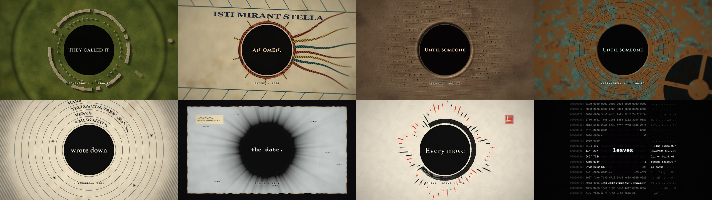
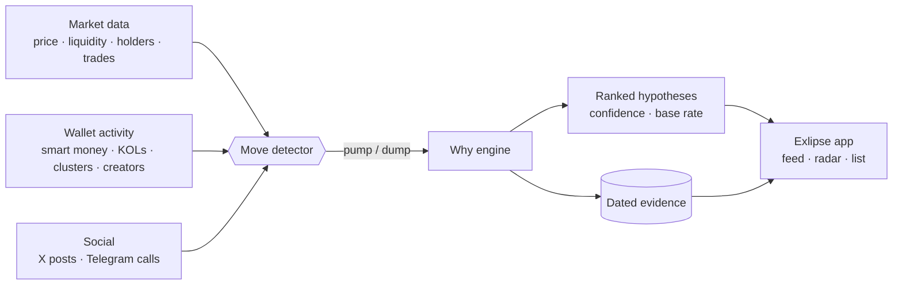

<div align="center">

<a href="https://exlipse.dev"></a>

<br>

[](https://exlipse.dev)
[](https://x.com/exlipse_dev)
[](https://t.me/exlipsedev_bot)
[](https://app.exlipse.dev)

### Why did that meme token move?

Exlipse links every pump and dump to **dated on-chain and social evidence**,<br>
ranks the possible causes with a **confidence level** and a **base rate**,<br>
and never pretends to know more than the evidence shows.

**No ratings. No calls. No guessed intent.**

[Website](https://exlipse.dev) · [Open the app](https://app.exlipse.dev) · [X](https://x.com/exlipse_dev) · [Telegram](https://t.me/exlipsedev_bot)

</div>

<br>

## The idea

For three thousand years people looked at an eclipse and called it an omen.
Then someone started writing down the date — and the omen became a pattern you could predict.

A meme token that runs **+300% in nine minutes** gets the same treatment today: a hundred stories, no dates.
Exlipse keeps the record instead. For every move it shows what happened *before* the move, when exactly it happened,
and how often that kind of signal comes before a move at all.

<div align="center">

<sub>Stills from the Exlipse film — Stonehenge, Bayeux, Babylon, Antikythera, Copernicus, Sobral 1919, Dojima, the genesis block.</sub>
</div>

<br>

## Principles

<table>
<tr>
<td width="50%" valign="top">

**🕰 Dated evidence**<br>
Every reason carries timestamps. Evidence that lands after a move started is labelled *followed*, never *cause*.

</td>
<td width="50%" valign="top">

**📊 Confidence, not certainty**<br>
Hypotheses are ranked by one deterministic, reproducible formula. Rival reasons split the credit.

</td>
</tr>
<tr>
<td valign="top">

**📐 Base rates**<br>
A signal counts only as much as it beats chance. Where history is still thin, Exlipse says so and caps its confidence.

</td>
<td valign="top">

**🚫 No verdicts, no intent**<br>
No token grades, no buy or sell calls. Exlipse never claims what a wallet *meant* — only what it did, and when.

</td>
</tr>
</table>

## How it works



**1 · Detect the move.** A pump opens when market cap rises **40%+ from a local low within 15 minutes**, with at least
**$2k of liquidity** and **20+ trades** in the window — one swap in an empty pool is not a pump. A dump is the mirror:
**−50% within 15 minutes**.

**2 · Collect what came before.** Everything that touched the token is stored with its own timestamp:
smart-money and KOL buys, synchronized buy clusters, migrations, creator sells and burns, trending entries,
paid promotion, artificial volume, posts on X and calls in public Telegram channels.

**3 · Rank the hypotheses.** One formula, no black box:

```text
confidence ∝ precedence × lag decay × signal strength × lift over the base rate
```

- **Precedence** — evidence after the start of the move is *followed*, not a cause.
- **Lag decay** — the closer to the start, the stronger; each kind of signal decays at its own rate.
- **Lift** — how much more often moves follow this signal than chance alone.
- **Caps** — no base rate yet: at most *medium*. A single piece of evidence never reaches *high*.

## What counts as a reason

| Hypothesis | What Exlipse looks at |
|---|---|
| Smart-money buy | Wallets with a track record buying before the start |
| KOL buy | Known accounts' wallets entering, and how late |
| Buy cluster | Several wallets buying within minutes — organic or bundled |
| Migration | Bonding curve completed, liquidity moved |
| Creator action | Developer selling, burning or closing |
| Trending entry | The token entering top lists — often a *result*, shown honestly |
| Paid promotion | Boosts and ads bought before the move |
| Artificial volume | Wash trading and bot share rising with the volume |
| X post | A post tied to the token's contract address |
| Telegram call | A public channel posting the address or the ticker |

## The product

<div align="center">
<a href="https://exlipse.dev"></a>
</div>

<br>

- **Feed** — moves as they happen, each with its lead reason and the evidence behind it.
- **Live** — every live token at once, as a **Radar** or as a sortable **List** with age, stage, market cap, liquidity, holders, move and why.
- **Token** — the full ranked list of hypotheses, with dates, confidence and base rate.
- **Sign-in** — Telegram or a username; Discord is next.

| Chain | Coverage |
|---|---|
| Solana | Market data, wallets, posts — full evidence |
| BNB Chain | Market data |
| Base | Market data |
| Robinhood | Market data |

## Status

| Phase | What | State |
|---|---|---|
| 1 | Market and wallet ingestion, move detector, why engine | ✅ Live since September 2026 |
| 2 | X posts and Telegram channels as evidence | ✅ Live since September 2026 |
| 3 | Wallet graph — who moves together | 🛠 Planned |

Exlipse is in **early access**. Base rates are still being collected, so confidence is capped where history is thin.

## The film

<div align="center">

<br>
<sub><i>They called it an omen. Until someone wrote down the date. Every move leaves a trace.</i></sub>
</div>

<br>

## Under the hood

<div align="center">


</div>

Go services ingest market, wallet and X data and run the move detector and the why engine; a Python service turns X posts and Telegram channels into evidence;
PostgreSQL 17 keeps every piece of evidence with its timestamp; the web app is React 19.

## In this repository

| Path | What | Languages |
|---|---|---|
| [`film/`](film) | The Exlipse film, rendered from code — 27 WebGL2 scenes, era typography, a synthesized score | TypeScript · GLSL · Python |
| [`spec/`](spec) | The public evidence format — what a move, a hypothesis and a piece of evidence look like | Go · TypeScript · Python · JSON Schema |
| [`assets/`](assets) | Banner, stills, logo | — |

> [!NOTE]
> **The Exlipse product is closed source.** The ingestion pipeline, the move detector, the why engine and the app
> are not published here. This repository holds the film, the public evidence format and brand assets.

## Links

| | |
|---|---|
| 🌐 Website | [exlipse.dev](https://exlipse.dev) |
| 🖥 App | [app.exlipse.dev](https://app.exlipse.dev) |
| 𝕏 X | [@exlipse_dev](https://x.com/exlipse_dev) |
| ✈️ Telegram | [@exlipsedev_bot](https://t.me/exlipsedev_bot) |

<br>

<div align="center">

<br>
<sub>Exlipse is not financial advice. It shows evidence and how much it is worth — the decision is always yours.</sub>
<br>
<sub>© 2026 Exlipse. Brand assets in this repository are all rights reserved.</sub>
</div>
